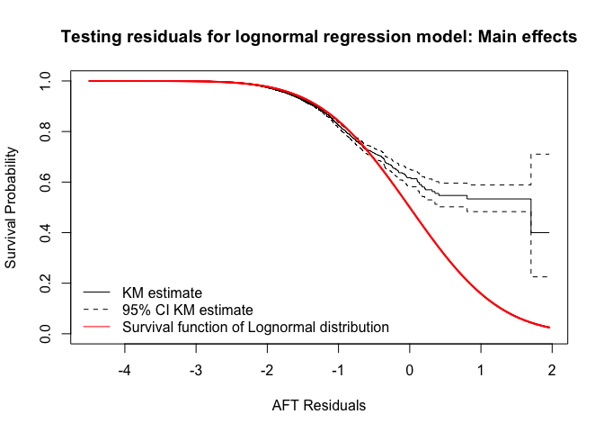
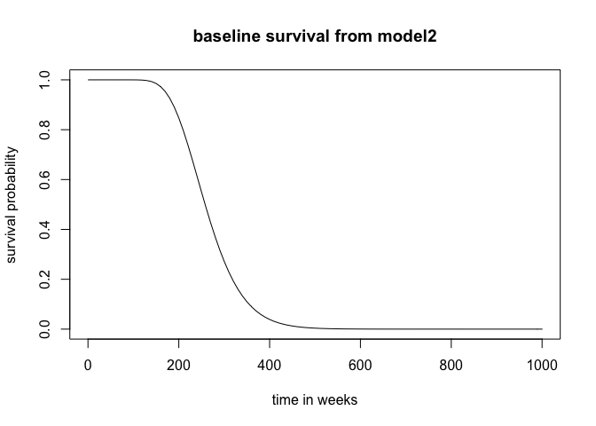
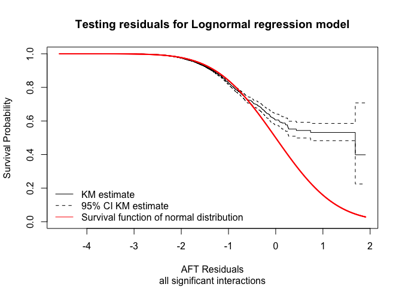

### Required Libraries and dependencies


```r
library(dplyr)
library(data.table)
library(survival)
library(multcomp)
library(MASS)
library(skimr)
```


### DESCRIPTION OF DATA

### Factors: 

#### parity 4 levels: last parity at time of failure/ event
 
 1 = 1st parity
 
 2 = 2nd parity
 
 3 = parity 3 and 4
 
 4 = more than 4 parities
 
##### fprfactor 1 for ketosis(fat protein ratio): proportion of times fpr > 1.5 

##### on test dates of MPR where days in milk <= 100 days

 1. Below 50%
 
 2. More than 50%

##### fprfactor 2 for SARA (fat protein ratio): proportion of times fpr < 0.9 

##### on test dates of MPR where days in milk <= 100 days

 1. Below 50%
 
 2. More than 50%

##### SCCfactor 4 levels: somatic cell count on test day X 1000/ ml

 1. less than 200 => SCC < 200,000
 
 2. 200 to 600 => 200,000 < SCC <= 600,000
 
 4. 600 to 1000 => 600,000 < SCC <= 1 million
 
 5. more than 1000 => SCC > 1 million
 
##### perfactor: calendar time based perturbations factor for each year of event, 4 levels

 1. before 2013, between 2013 and 2016, beyond 2016
 
 2. based on --> year @ TestDate
 
##### LactValue1: 3levels => relative production level of animals
 
 1. less than 90 = Lactatiewaarde <= 900
 
 2. between 91 to 110 = 91 <= LW <= 110
 
 2. more than 110 = LW > 110

##### Insemfactor: 3 levels

 1. below 2 = rolling average inseminations per parity <= 2
 
 2. between 2 and 5 =  2 < roll_insem <= 5
 
 3. beyond 5 = roll_insem > 5


**Variable type: character**

|skim_variable    | n_missing| complete_rate| min| max| empty| n_unique| whitespace|
|:----------------|---------:|-------------:|---:|---:|-----:|--------:|----------:|
|AnimalIdentifier |         0|             1|  13|  13|     0|     3858|          0|
|lastparity       |         0|             1|  10|  20|     0|        4|          0|


**Variable type: Date**

|skim_variable | n_missing| complete_rate|min        |max        |median     | n_unique|
|:-------------|---------:|-------------:|:----------|:----------|:----------|--------:|
|BirthDate     |         0|             1|1995-06-09 |2017-12-29 |2010-10-18 |     2670|
|TestDate      |         0|             1|2009-01-02 |2019-12-28 |2015-01-30 |      860|
|max_date      |         0|             1|2009-02-05 |2019-12-28 |2017-02-17 |      769|
|min_date      |         0|             1|2009-01-02 |2019-11-16 |2012-12-06 |      782|


**Variable type: factor**

|skim_variable | n_missing| complete_rate|ordered | n_unique|top_counts                                     |
|:-------------|---------:|-------------:|:-------|--------:|:----------------------------------------------|
|parity        |         0|             1|FALSE   |        4|3-4: 26918, 1st: 26526, 2nd: 21958, mor: 11925 |
|SCCfactor     |         0|             1|FALSE   |        4|bel: 70738, bet: 11365, mor: 2982, bet: 2242   |
|fprfactor     |         0|             1|FALSE   |        2|bel: 86040, mor: 1287                          |
|fprfactor2    |         0|             1|FALSE   |        2|Bel: 87219, mor: 108                           |
|LactValue1    |         0|             1|FALSE   |        3|bet: 50098, bel: 19922, mor: 17307             |
|perfactor     |         0|             1|FALSE   |        3|bef: 34167, bet: 27225, bey: 25935             |
|Insemfactor   |         0|             1|FALSE   |        3|bel: 45269, bet: 39016, bey: 3042              |


**Variable type: numeric**

|skim_variable  | n_missing| complete_rate|       mean|         sd|        p0|        p25|        p50|        p75|       p100|hist  |
|:--------------|---------:|-------------:|----------:|----------:|---------:|----------:|----------:|----------:|----------:|:-----|
|HerdIdentifier |         0|             1| 5262078.27| 2473108.25| 796147.00| 3179909.00| 5067760.00| 7431575.00| 8816327.00|▆▁▇▅▇ |
|event          |         0|             1|       0.03|       0.16|      0.00|       0.00|       0.00|       0.00|       1.00|▇▁▁▁▁ |
|tstart         |         0|             1|     229.41|      98.83|     87.57|     151.86|     207.14|     283.00|     926.57|▇▃▁▁▁ |
|tstop          |         0|             1|     235.35|      98.92|     93.00|     158.57|     213.43|     288.86|     931.26|▇▃▁▁▁ |
|LactValue      |         0|             1|      97.02|      22.12|      0.00|      92.00|     100.00|     109.00|     193.00|▁▁▇▁▁ |


### Model: all main effects

```
## 
## Call:
## survreg(formula = Surv(tstart, tstop, event = event, type = "interval") ~ 
##     LactValue1 + parity + Insemfactor + SCCfactor + fprfactor + 
##         fprfactor2 + perfactor, data = df2, dist = "lognormal", 
##     model = T, robust = TRUE, cluster = HerdIdentifier)
##                                  Value Std. Err (Naive SE)     z      p
## (Intercept)                     5.5528   0.0411     0.0106 135.1 <2e-16
## LactValue1below 90             -0.1162   0.0074     0.0057 -15.7 <2e-16
## LactValue1more than 110         0.0500   0.0061     0.0086   8.3 <2e-16
## parity2nd parity                0.3075   0.0105     0.0081  29.4 <2e-16
## parity3-4th parity              0.6369   0.0140     0.0075  45.5 <2e-16
## paritymore than 4 parities      1.0392   0.0156     0.0086  66.7 <2e-16
## Insemfactorbetween 2 and 5      0.0605   0.0134     0.0053   4.5  7e-06
## Insemfactorbeyond 5             0.0873   0.0187     0.0127   4.7  3e-06
## SCCfactorbetween 200 and 600   -0.0419   0.0075     0.0067  -5.6  3e-08
## SCCfactorbetween 600 and 1000  -0.0675   0.0167     0.0125  -4.1  5e-05
## SCCfactormore than 1000        -0.1355   0.0140     0.0096  -9.7 <2e-16
## fprfactormore than 50%          0.0493   0.0285     0.0192   1.7   0.08
## fprfactor2more than 50%         0.0052   0.0183     0.0796   0.3   0.78
## perfactorbetween 2014 and 2016 -0.0195   0.0274     0.0064  -0.7   0.48
## perfactorbeyond 2016           -0.0665   0.0279     0.0062  -2.4   0.02
## Log(scale)                     -1.3923   0.0448     0.0136 -31.1 <2e-16
## 
## Scale= 0.25 
## 
## Log Normal distribution
## Loglik(model)= -17992.3   Loglik(intercept only)= -20620.1
## 	Chisq= 5255.53 on 14 degrees of freedom, p= 0 
## (Loglikelihood assumes independent observations)
## Number of Newton-Raphson Iterations: 10 
## n= 87327
```

<!-- --><!-- -->

### Model: all interactions (except insemfactor and fprfactor2 **)


```
## 
## Call:
## survreg(formula = Surv(tstart, tstop, event = event, type = "interval") ~ 
##     LactValue1 + parity + Insemfactor + SCCfactor + fprfactor + 
##         perfactor + fprfactor2 + LactValue1:perfactor + fprfactor:perfactor + 
##         parity:perfactor + SCCfactor:perfactor, data = df2, dist = "lognormal", 
##     model = T, robust = TRUE, cluster = HerdIdentifier)
##                                                                 Value Std. Err (Naive SE)     z      p
## (Intercept)                                                   5.5e+00  3.9e-02    1.3e-02 143.5 <2e-16
## LactValue1below 90                                           -1.1e-01  1.1e-02    9.3e-03  -9.6 <2e-16
## LactValue1more than 110                                       7.2e-02  1.7e-02    1.5e-02   4.2  3e-05
## parity2nd parity                                              3.0e-01  1.3e-02    1.4e-02  23.7 <2e-16
## parity3-4th parity                                            6.3e-01  1.8e-02    1.2e-02  34.1 <2e-16
## paritymore than 4 parities                                    1.1e+00  2.5e-02    1.4e-02  41.5 <2e-16
## Insemfactorbetween 2 and 5                                    5.9e-02  1.3e-02    5.3e-03   4.5  7e-06
## Insemfactorbeyond 5                                           8.6e-02  1.9e-02    1.3e-02   4.6  4e-06
## SCCfactorbetween 200 and 600                                 -5.0e-02  1.2e-02    1.1e-02  -4.4  1e-05
## SCCfactorbetween 600 and 1000                                -7.9e-02  3.1e-02    1.9e-02  -2.5  0.011
## SCCfactormore than 1000                                      -1.4e-01  1.7e-02    1.6e-02  -8.2 <2e-16
## fprfactormore than 50%                                        9.9e-02  4.3e-02    2.4e-02   2.3  0.021
## perfactorbetween 2014 and 2016                                6.1e-03  3.5e-02    1.6e-02   0.2  0.862
## perfactorbeyond 2016                                         -7.5e-02  2.7e-02    1.5e-02  -2.8  0.005
## fprfactor2more than 50%                                       6.2e-03  1.7e-02    8.0e-02   0.4  0.717
## LactValue1below 90:perfactorbetween 2014 and 2016            -1.2e-02  1.5e-02    1.4e-02  -0.8  0.396
## LactValue1more than 110:perfactorbetween 2014 and 2016       -5.0e-02  2.6e-02    2.2e-02  -1.9  0.052
## LactValue1below 90:perfactorbeyond 2016                      -6.6e-03  1.8e-02    1.3e-02  -0.4  0.719
## LactValue1more than 110:perfactorbeyond 2016                 -2.0e-02  2.3e-02    2.1e-02  -0.9  0.391
## fprfactormore than 50%:perfactorbetween 2014 and 2016        -1.7e-01  7.7e-02    4.3e-02  -2.2  0.026
## fprfactormore than 50%:perfactorbeyond 2016                  -1.7e-01  7.6e-02    7.4e-02  -2.3  0.024
## parity2nd parity:perfactorbetween 2014 and 2016              -4.4e-03  1.8e-02    2.1e-02  -0.2  0.810
## parity3-4th parity:perfactorbetween 2014 and 2016            -5.9e-03  1.6e-02    1.9e-02  -0.4  0.706
## paritymore than 4 parities:perfactorbetween 2014 and 2016    -3.7e-02  2.7e-02    2.1e-02  -1.4  0.174
## parity2nd parity:perfactorbeyond 2016                         2.2e-02  1.3e-02    1.9e-02   1.7  0.089
## parity3-4th parity:perfactorbeyond 2016                       2.6e-02  2.0e-02    1.8e-02   1.3  0.207
## paritymore than 4 parities:perfactorbeyond 2016              -2.3e-02  3.5e-02    2.0e-02  -0.7  0.510
## SCCfactorbetween 200 and 600:perfactorbetween 2014 and 2016   8.0e-03  1.5e-02    1.6e-02   0.5  0.604
## SCCfactorbetween 600 and 1000:perfactorbetween 2014 and 2016 -4.1e-05  4.0e-02    3.1e-02   0.0  0.999
## SCCfactormore than 1000:perfactorbetween 2014 and 2016       -1.2e-02  2.1e-02    2.4e-02  -0.6  0.554
## SCCfactorbetween 200 and 600:perfactorbeyond 2016             2.0e-02  1.2e-02    1.6e-02   1.6  0.112
## SCCfactorbetween 600 and 1000:perfactorbeyond 2016            3.2e-02  3.9e-02    2.9e-02   0.8  0.422
## SCCfactormore than 1000:perfactorbeyond 2016                  1.4e-02  1.9e-02    2.2e-02   0.8  0.452
## Log(scale)                                                   -1.4e+00  4.4e-02    1.4e-02 -31.7 <2e-16
## 
## Scale= 0.25 
## 
## Log Normal distribution
## Loglik(model)= -17972.6   Loglik(intercept only)= -20620.1
## 	Chisq= 5294.91 on 32 degrees of freedom, p= 0 
## (Loglikelihood assumes independent observations)
## Number of Newton-Raphson Iterations: 10 
## n= 87327
```

<!-- -->
___________________________________ <br/>
** Stepwise backward selection with AIC removes insignificant factors/ interactions
Look here for [details](https://www.rdocumentation.org/packages/MASS/versions/7.3-53/topics/stepAIC)


```
## --Anova and AIC for difference in main effects and interaction model--
```

```
## ANOVA
```


|Terms                                                                                                                                                                    | Resid. Df|    -2*LL|Test | Df| Deviance|  Pr(>Chi)|
|:------------------------------------------------------------------------------------------------------------------------------------------------------------------------|---------:|--------:|:----|--:|--------:|---------:|
|LactValue1 + parity + Insemfactor + SCCfactor + fprfactor + fprfactor2 + perfactor                                                                                       |     87311| 35984.58|     | NA|       NA|        NA|
|LactValue1 + parity + Insemfactor + SCCfactor + fprfactor + perfactor + fprfactor2 + LactValue1:perfactor + fprfactor:perfactor + parity:perfactor + SCCfactor:perfactor |     87293| 35945.20|=    | 18| 39.37912| 0.0025337|

```
## AIC
```


|         | df|      AIC|
|:--------|--:|--------:|
|modsurv2 | 16| 36016.58|
|modsurv3 | 34| 36013.20|


### frailty attempt


```
## 
## Call:
## survreg(formula = Surv(tstart, tstop, event = event, type = "interval") ~ 
##     LactValue1 + parity + Insemfactor + SCCfactor + fprfactor + 
##         perfactor + fprfactor2 + LactValue1:perfactor + fprfactor:perfactor + 
##         parity:perfactor + SCCfactor:perfactor + frailty(HerdIdentifier), 
##     data = df2, dist = "lognormal")
##                                                                Value Std. Error      z      p
## (Intercept)                                                   5.5400     0.3162   17.5 <2e-16
## LactValue1below 90                                           -0.1071     0.0090  -11.9 <2e-16
## LactValue1more than 110                                       0.0667     0.0146    4.6  5e-06
## parity2nd parity                                              0.2975     0.0131   22.7 <2e-16
## parity3-4th parity                                            0.6229     0.0120   52.0 <2e-16
## paritymore than 4 parities                                    1.0358     0.0136   76.1 <2e-16
## Insemfactorbetween 2 and 5                                    0.0650     0.0053   12.2 <2e-16
## Insemfactorbeyond 5                                           0.0878     0.0125    7.0  2e-12
## SCCfactorbetween 200 and 600                                 -0.0445     0.0102   -4.4  1e-05
## SCCfactorbetween 600 and 1000                                -0.0701     0.0189   -3.7  2e-04
## SCCfactormore than 1000                                      -0.1335     0.0153   -8.7 <2e-16
## fprfactormore than 50%                                        0.0833     0.0236    3.5  4e-04
## perfactorbetween 2014 and 2016                                0.0029     0.0159    0.2  0.854
## perfactorbeyond 2016                                         -0.0814     0.0150   -5.4  5e-08
## fprfactor2more than 50%                                       0.0069     0.0788    0.1  0.930
## LactValue1below 90:perfactorbetween 2014 and 2016            -0.0155     0.0135   -1.2  0.249
## LactValue1more than 110:perfactorbetween 2014 and 2016       -0.0488     0.0210   -2.3  0.020
## LactValue1below 90:perfactorbeyond 2016                      -0.0084     0.0129   -0.7  0.512
## LactValue1more than 110:perfactorbeyond 2016                 -0.0212     0.0202   -1.0  0.295
## fprfactormore than 50%:perfactorbetween 2014 and 2016        -0.1733     0.0426   -4.1  5e-05
## fprfactormore than 50%:perfactorbeyond 2016                  -0.2047     0.0724   -2.8  0.005
## parity2nd parity:perfactorbetween 2014 and 2016              -0.0037     0.0199   -0.2  0.853
## parity3-4th parity:perfactorbetween 2014 and 2016             0.0023     0.0181    0.1  0.900
## paritymore than 4 parities:perfactorbetween 2014 and 2016    -0.0214     0.0203   -1.1  0.293
## parity2nd parity:perfactorbeyond 2016                         0.0243     0.0185    1.3  0.189
## parity3-4th parity:perfactorbeyond 2016                       0.0292     0.0171    1.7  0.088
## paritymore than 4 parities:perfactorbeyond 2016              -0.0055     0.0199   -0.3  0.781
## SCCfactorbetween 200 and 600:perfactorbetween 2014 and 2016   0.0052     0.0156    0.3  0.741
## SCCfactorbetween 600 and 1000:perfactorbetween 2014 and 2016 -0.0106     0.0297   -0.4  0.723
## SCCfactormore than 1000:perfactorbetween 2014 and 2016       -0.0156     0.0229   -0.7  0.497
## SCCfactorbetween 200 and 600:perfactorbeyond 2016             0.0158     0.0158    1.0  0.317
## SCCfactorbetween 600 and 1000:perfactorbeyond 2016            0.0220     0.0286    0.8  0.441
## SCCfactormore than 1000:perfactorbeyond 2016                  0.0117     0.0216    0.5  0.588
## Log(scale)                                                   -1.4331     0.0136 -105.1 <2e-16
## 
## Scale= 0.24 
## 
## Log Normal distribution
## Loglik(model)= -17804.1   Loglik(intercept only)= -20620.1
## 	Chisq= 5631.87 on 40 degrees of freedom, p= 0 
## Number of Newton-Raphson Iterations: 10 18 
## n= 87327
```


|frailty_var |details                                           |
|:-----------|:-------------------------------------------------|
|frail       |0.06,0.02,0.04,0,0.01,-0.09,-0.06,0.01,0.07,-0.06 |
|fvar        |0.1,0.1,0.1,0.1,0.1,0.1,0.1,0.1,0.1,0.1           |
|penalty     |0.01                                              |
